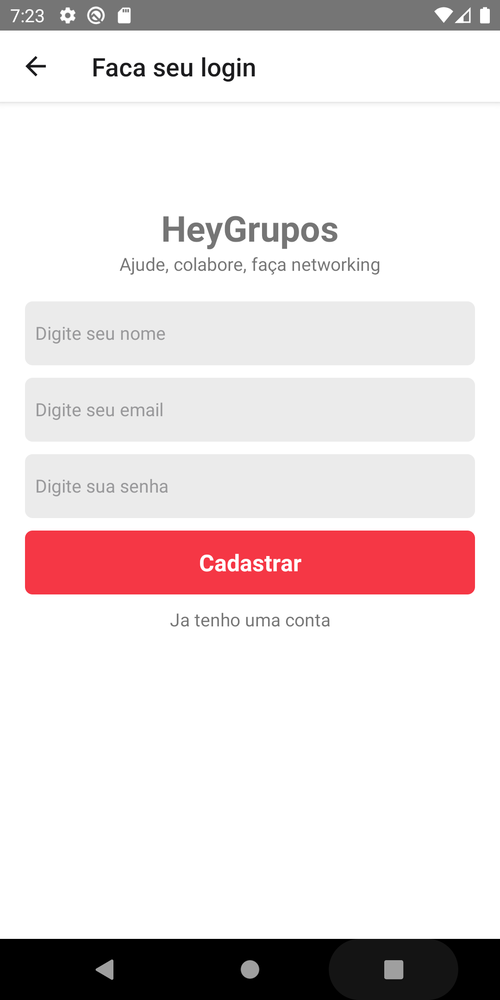
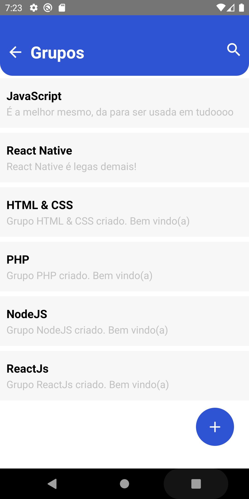
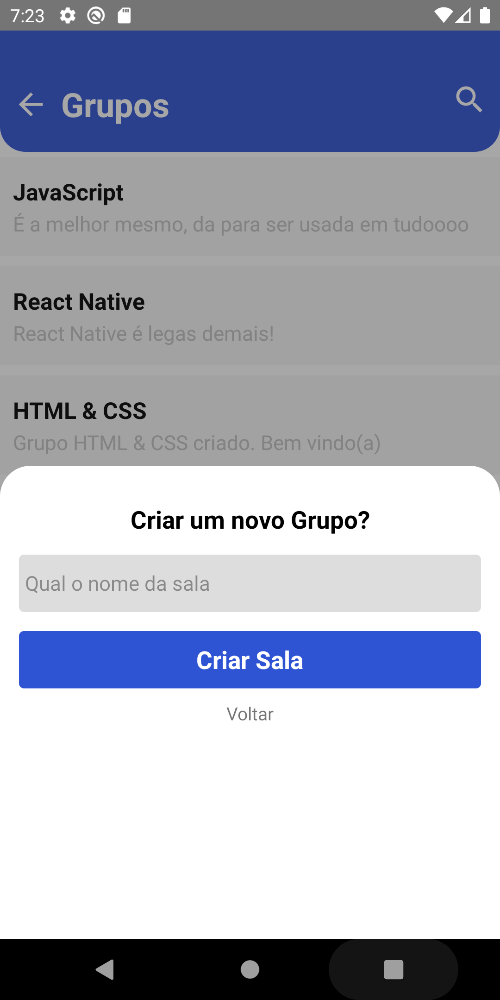
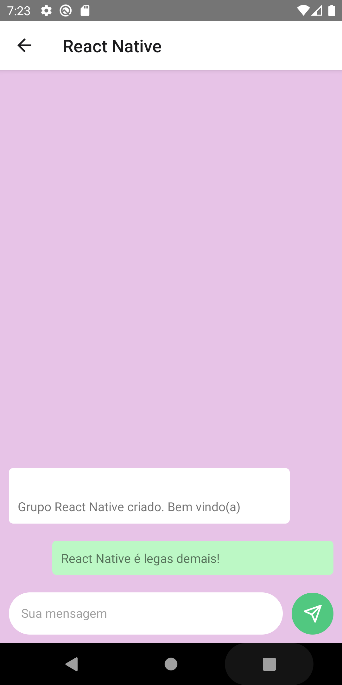
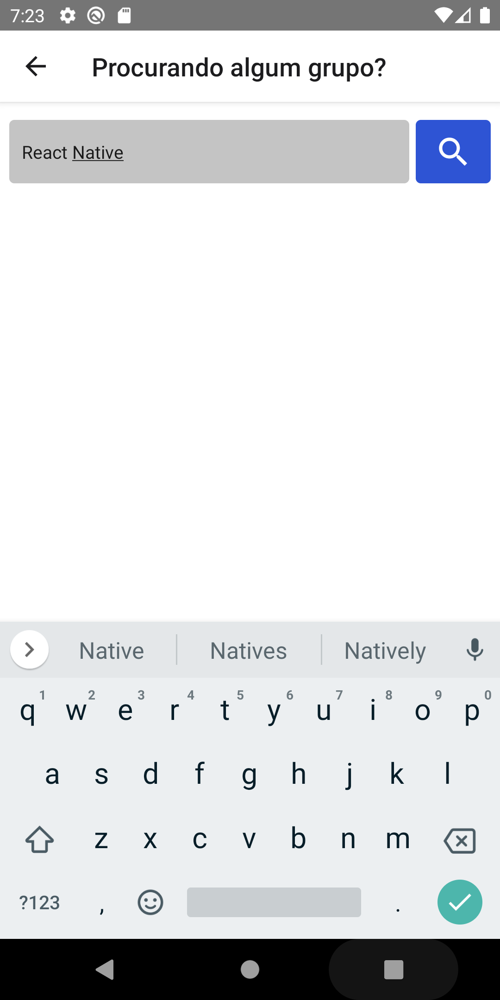
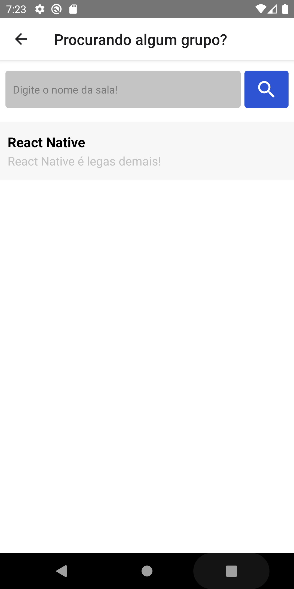

# Hey Grupos

App criado com React Native, o app consiste em uma sala de chats, onde pode
rolar uma conversa entre as pessoas logadas, para poder participar do chats
deve se cadastrar, assim liberando a sala para conversar com os Devs 😉,


### INSTALAÇÃO

1. Clone o repositório

   ```sh
   git clone https://github.com/NiloMarcos/HeyChat.git
   ```

2. Entre na pasta

   ```sh
   cd HeyChat
   ```

3. Instale as dependências

   ```sh
   yarn
   ```

   ou

   ```sh
   npm i

4. Rodar o projeto

   ```sh
   npx react-native run-android
   ```

    ou

   ```sh
   npx react-native run-ios
   ```
## Tech Stack

**Client:** React Native, JavaScript

**Server:** Firebase

### Fotos da aplicação

<p align="center">
<table  style="border: none">
  <tr>
    <td>
      
    </td>
    <td>
      
    </td>
    <td>
      
    </td>
  </tr>
</table>
</p>

<p align="center">
<table  style="border: none">
  <tr>
    <td>
      
    </td>
    <td>
      
    </td>
    <td>
      
    </td>
    <td>
      
    </td>
  </tr>
</table>
</p>